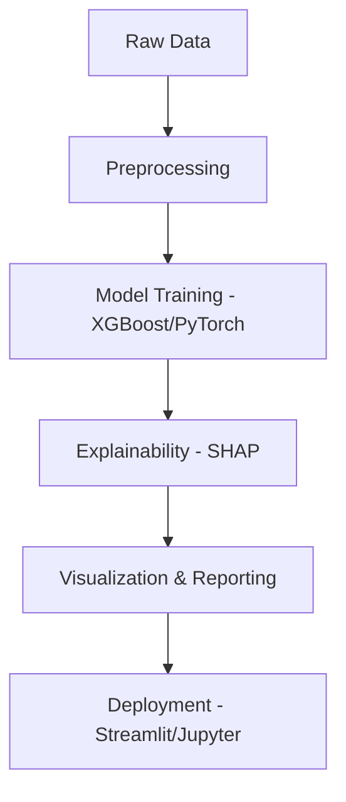

# 🩺 CardioNLP – Bilingual AI Assistant for Cardiovascular Risk

## 🌍 Why This Matters

Cardiovascular disease is the leading cause of death globally. Early risk detection can save lives — but many patients are underserved due to language barriers, fragmented data, and opaque algorithms.

**CardioNLP** addresses these challenges by:
- Integrating structured and unstructured data for richer insights
- Supporting bilingual output to improve accessibility
- Using interpretable models clinicians can trust
- Simulating federated learning to protect patient privacy

This project reflects Sanofi’s mission to use AI for good, promote health equity, and transform healthcare through ethical innovation.

## 🚀 Features
* XGBoost risk model with SHAP explainability
* BioBERT-powered NLP pipeline
* HEART score override logic
* Bilingual output (English/Chinese)
* Fairness analysis across ethnic groups (now robust to single-class groups in ROC AUC)
* Streamlit app for interactive use

## 📦 How to Run
## 🛠️ Project Workflow


```bash
pip install -r requirements.txt
streamlit run app/app.py
```

## 📊 Notebooks


Jupyter notebooks for data exploration, model training, NLP, fairness/bias analysis, and advanced data science demonstrations are in `notebooks/`.

### 00_literature_review.ipynb
Summarizes key papers in cardiovascular AI, including deep learning for risk prediction, BioBERT for biomedical NLP, and fairness in medical AI.

### 01_data_exploration.ipynb
Explores the dataset with pandas and seaborn, showing distributions, missing values, correlations, and categorical feature analysis.

### 02_model_training.ipynb
Trains an XGBoost model for cardiovascular risk prediction, evaluates performance (AUC), and demonstrates SHAP explainability.

### 03_nlp_pipeline.ipynb
Uses BioBERT and HuggingFace Transformers to extract clinical entities from text, demonstrating biomedical NLP.

### 04_bias_fairness_analysis.ipynb
Evaluates model fairness by calculating ROC AUC across ethnic groups, skipping groups with only one class in the target variable to avoid undefined metrics and warnings.

### 05_data_scientist_demo.ipynb
Demonstrates advanced analytics, machine learning (XGBoost, PyTorch), NLP, SQL, federated learning (Flower), and data visualization (Plotly) for a data scientist role.

